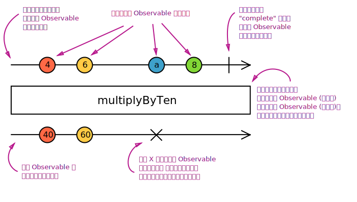

### operators(操作符)
尽管RxJS的根基是Observable, 但最有用的还是它的**操作符**。操作符是允许复杂的异步代码以声明式的方式进行轻松组合的基础代码单元。

#### 什么是操作符?
操作符都是**函数**。 这里有两种类型的操作符:
**Pipeable Operators(管道操作符)**是一类可以通过语法`observableInstance.pipe(operator())`传递给Observable的操作符。包括[<font color=#B7178C>filter(...)</font>], [<font color=#B7178C>mergeMap</font>](xxx)(xxx)。调用时,它们不会改变已存在的Observable实例。相反, 它们会返回一个订阅逻辑基于第一个Observable的新的Observable。
> 管道操作符是一个函数, 其需要一个Observable作为他的输入项并且返回另一个新的Observable。它是'纯'(pure)操作符: 之前的Observable保持不变。
管道操作符本质上是一个纯函数, 其需要一个Observable作为输入项并生成一个新的Observable作为输出项。订阅输出的Observable同时也会订阅输入的Observable。

**创建操作符** 是另一类操作符, 它可以被当做一个独立的函数去调用并创建一个新的Observable。举个例子: `of(1, 2, 3)`会创建一个observable, 并会一次派发1, 2, 3。创建操作符在下个单元会被详细介绍。

举个例子, `map`操作符是有着跟`Array.prototype.map`一样的名字。就像`[1, 2, 3].map(x => x * x)`将会产出`[1, 4, 9]`一样,  我们可以用`of`操作符来这样创建Observable: 
```js
import { of } from 'rxjs';
import { map } from 'rxjs/operators';

map(x => x * x)(of(1, 2, 3)).subscribe((v) => console.log(`value: ${v}`));

// Logs:
// value: 1 
// value: 4
// value: 9
```
上述代码会一次输出`1`, `4`, `9`。 另一个有用的操作符是[<font color=#B7178C>first</font>](xxx)
```js
import { of } from 'rxjs';
import { first } from 'rxjs/operators';

first()(of(1, 2, 3)).subscribe((v) => console.log(`value: ${v}`));

// Logs:
// value: 1
```
Note that map logically must be constructed on the fly, since it must be given the mapping function to. By contrast, first could be a constant, but is nonetheless constructed on the fly. As a general practice, all operators are constructed, whether they need arguments or not.

#### 管道
管道操作符都是函数, 所以他们可以被当做普通函数一样使用: `op()(obs)` - 但是在实践中, 通常会很容易变得很乱且可读性很差:`op4()(op3()(op2()(op1()(obs))))`。出于以上考虑, Observable拥有一个`.pipe()`的函数可以处理相同的场景并拥有更好的可读性。
```js
obs.pipe(
  op1(),
  op2(),
  op3(),
  op3(),
)
```
从代码风格角度上看, `op()(obs)`是从不会被使用的, 甚至在只有一个操作符的情况下, obs.pipe(op())都是更好的选择。

#### 创建操作符

**什么是创建操作符?** 与管道操作符截然不同, 创建操作符是一种可以通过一些通用的预定义行为或者连接其他Observable去创建Observabe的函数。
一个典型创建操作符的例子就是`interval`函数。它需要一个`number`(不是Obervable)作为入参, 并且产出一个Observable:
```js
import { interval } from 'rxjs';

const observable = interval(1000 /* number of milliseconds */);
```
#### 高阶Observables
Observables通常会派发一个普通值(例如字符串, 数字), 但是有些时候, 我们需要去着手`Observables of Observables`, 我们称之它为高阶Observable。举个例子, 假设你有一个派发字符串的Observable, 这些字符串是你想要查看的文件的URL。代码可能是这样的:
```js
const fileObservable = urlObservable.pipe(
   map(url => http.get(url)),
);
```
`http.get()`为每个单独的URL返回一个Observable(或字符串, 或字符串数组)。现在你有一个高阶Observable `Observables of Observables`。
但是你该如何使用高阶Observable呢? 通常会使用扁平化: 通过任何方法将一个高阶Observable转化成一个普通Observable。 举个例子:
```js
const fileObservable = urlObservable.pipe(
   map(url => http.get(url)),
   concatAll(),
);
```
`concatAll()`运算符按照顺序订阅每个外部Observable中的内部Observable, 并且复制每个派发的值直到Observable完成, 然后继续订阅下一个Observable。所有的值都会被通过这样的方法连接。这里还有其他区一些连接操作符(组合操作符):
* [<font color=#B7178C>mergeAll()</font>](xxx) - `merge`操作符是按照'先到先得'策略, 每当观察到内部Observable发出时, 就会订阅并输出Observable上的这个内部Observable的所有值。(as it arrives可以理解为当数据流抵达时, 结合'先到先得'策略理解)
* [<font color=#B7178C>switchAll()</font>](xxx) - 订阅第一个抵达的Observable并派发该Observable的所有值, 待下一个Oservable抵达时, 依次取消上一个订阅并订阅最新的Observable。
* [<font color=#B7178C>switchAll()</font>](xxx) - 订阅第一个抵达的Observable并派发该Observable的所有值, 在该Observable完成之前丢弃所有新抵达的Observable, 并在完成后等待一下个内部Observable。

就像很多数组库将`map()`和`flat()`(或者`faltten()`)结合成`flatMap()`一样, 所有RxJS的展平运算符有[<font color=#B7178C>concatMap()</font>](xxx), [<font color=#B7178C>mergeMap()</font>](xxx), [<font color=#B7178C>switchMap()</font>](xxx), [<font color=#B7178C>exhaustMap()</font>](xxx)这些映射等效项。

#### 弹珠图

文本描述往往是不能够去完整的解释操作符是如何工作的。很多操作符都是跟时间相关的, 它们可能会以不同的方式延迟(delay), 取样(sanmple), 节流(throttle)或去防抖(debounce)值。图标通常是更适合的工具。弹珠图是操作符运行方式的视觉表示, 其中包含输入Observable(s)、 操作符及其参数和输出的Observable。
> 在弹珠图中, 时间向右流, 图描述了在Observable执行中值('弹珠')是如何派发的。
下图是剖析弹珠图。

在整个文档站中, 我们广泛地使用弹珠图来解释操作符的工作方式。它们在其他环境中也可能非常有用, 例如在白板上, 甚至在我们的单元测试中如(ASCII图)。

#### 操作符种类
不同类型操作符有不同的目的, 这里被分类成以下几种: 创建操作符(creation), 过滤操作符(filtering), 组合操作符(joinng), 多播操作符(multicaing), 错误处理操作符(error handling), 工具操作符(utility)等等。 在以下列表中你可以找到所有被分好类的操作符。 你可以在[<font color=#B7178C>reference()</font>](xxx)看到更详细的内容。

##### 创建操作符
* [<font color=#B7178C>ajax</font>](xxx)
* [<font color=#B7178C>bindCallback</font>](xxx)
* [<font color=#B7178C>bindNodeCallback</font>](xxx)
* [<font color=#B7178C>defer</font>](xxx)
* [<font color=#B7178C>empty</font>](xxx)
* [<font color=#B7178C>from</font>](xxx)
* [<font color=#B7178C>fromEvent</font>](xxx)
* [<font color=#B7178C>fromEventPattern</font>](xxx)
* [<font color=#B7178C>generate</font>](xxx)
* [<font color=#B7178C>interval</font>](xxx)
* [<font color=#B7178C>of</font>](xxx)
* [<font color=#B7178C>range</font>](xxx)
* [<font color=#B7178C>throwError</font>](xxx)
* [<font color=#B7178C>timer</font>](xxx)
* [<font color=#B7178C>iif</font>](xxx)

##### 组合创建操作符
这里创建操作符同时拥有组合的功能 --- 派发多个源Observables的值。
* [<font color=#B7178C>combineLatest</font>](xxx)
* [<font color=#B7178C>concat</font>](xxx)
* [<font color=#B7178C>forkJoin</font>](xxx)
* [<font color=#B7178C>merge</font>](xxx)
* [<font color=#B7178C>partition</font>](xxx)
* [<font color=#B7178C>race</font>](xxx)
* [<font color=#B7178C>zip</font>](xxx)

##### 转换操作符
* [<font color=#B7178C>buffer</font>](xxx)
* [<font color=#B7178C>bufferCount</font>](xxx)
* [<font color=#B7178C>bufferTime</font>](xxx)
* [<font color=#B7178C>bufferToggle</font>](xxx)
* [<font color=#B7178C>bufferWhen</font>](xxx)
* [<font color=#B7178C>concatMap</font>](xxx)
* [<font color=#B7178C>concatMapTo</font>](xxx)
* [<font color=#B7178C>exhaust</font>](xxx)
* [<font color=#B7178C>exhaustMap</font>](xxx)
* [<font color=#B7178C>expand</font>](xxx)
* [<font color=#B7178C>groupBy</font>](xxx)
* [<font color=#B7178C>map</font>](xxx)
* [<font color=#B7178C>mapTo</font>](xxx)
* [<font color=#B7178C>mergeMap</font>](xxx)
* [<font color=#B7178C>mergeMapTo</font>](xxx)
* [<font color=#B7178C>mergeScan</font>](xxx)
* [<font color=#B7178C>pairwise</font>](xxx)
* [<font color=#B7178C>partition</font>](xxx)
* [<font color=#B7178C>pluck</font>](xxx)
* [<font color=#B7178C>scan</font>](xxx)
* [<font color=#B7178C>switchMap</font>](xxx)
* [<font color=#B7178C>switchMapTo</font>](xxx)
* [<font color=#B7178C>window</font>](xxx)
* [<font color=#B7178C>windowCount</font>](xxx)
* [<font color=#B7178C>windowTime</font>](xxx)
* [<font color=#B7178C>windowToggle</font>](xxx)
* [<font color=#B7178C>windowWhen</font>](xxx)

##### 过滤操作符
* [<font color=#B7178C>audit</font>](xxx)
* [<font color=#B7178C>auditTime</font>](xxx)
* [<font color=#B7178C>debounce</font>](xxx)
* [<font color=#B7178C>debounceTime</font>](xxx)
* [<font color=#B7178C>distinct</font>](xxx)
* [<font color=#B7178C>distinctKey</font>](xxx)
* [<font color=#B7178C>distinctUntilChanged</font>](xxx)
* [<font color=#B7178C>distinctUntilKeyChanged</font>](xxx)
* [<font color=#B7178C>elementAt</font>](xxx)
* [<font color=#B7178C>filter</font>](xxx)
* [<font color=#B7178C>first</font>](xxx)
* [<font color=#B7178C>ignoreElements</font>](xxx)
* [<font color=#B7178C>last</font>](xxx)
* [<font color=#B7178C>sample</font>](xxx)
* [<font color=#B7178C>sampleTime</font>](xxx)
* [<font color=#B7178C>single</font>](xxx)
* [<font color=#B7178C>skip</font>](xxx)
* [<font color=#B7178C>skipLast</font>](xxx)
* [<font color=#B7178C>skipUntil</font>](xxx)
* [<font color=#B7178C>skipWhile</font>](xxx)
* [<font color=#B7178C>take</font>](xxx)
* [<font color=#B7178C>takeLast</font>](xxx)
* [<font color=#B7178C>takeUntil</font>](xxx)
* [<font color=#B7178C>takeWhile</font>](xxx)
* [<font color=#B7178C>throttle</font>](xxx)
* [<font color=#B7178C>throttleTime</font>](xxx)

##### 组合操作符
同时可以参考[<font color=#B7178C>组合创建操作符</font>](xxx)单元。

* [<font color=#B7178C>combineAll</font>](xxx)
* [<font color=#B7178C>concatAll</font>](xxx)
* [<font color=#B7178C>exhaust</font>](xxx)
* [<font color=#B7178C>mergeAll</font>](xxx)
* [<font color=#B7178C>startWith</font>](xxx)
* [<font color=#B7178C>withLatestFrom</font>](xxx)

##### 多播操作符

* [<font color=#B7178C>multicast</font>](xxx)
* [<font color=#B7178C>publish</font>](xxx)
* [<font color=#B7178C>publishBehavior</font>](xxx)
* [<font color=#B7178C>publishLast</font>](xxx)
* [<font color=#B7178C>publishReplay</font>](xxx)
* [<font color=#B7178C>share</font>](xxx)

##### 错误处理操作符

* [<font color=#B7178C>catchError</font>](xxx)
* [<font color=#B7178C>retry</font>](xxx)
* [<font color=#B7178C>retryWhen</font>](xxx)

##### 工具操作符

* [<font color=#B7178C>tap</font>](xxx)
* [<font color=#B7178C>delay</font>](xxx)
* [<font color=#B7178C>delayWhen</font>](xxx)
* [<font color=#B7178C>dematerialize</font>](xxx)
* [<font color=#B7178C>materialize</font>](xxx)
* [<font color=#B7178C>observeOn</font>](xxx)
* [<font color=#B7178C>subscribeOn</font>](xxx)
* [<font color=#B7178C>timeInterval</font>](xxx)
* [<font color=#B7178C>timestamp</font>](xxx)
* [<font color=#B7178C>timeout</font>](xxx)
* [<font color=#B7178C>timeoutWith</font>](xxx)
* [<font color=#B7178C>toArray</font>](xxx)

##### 条件布尔操作符

* [<font color=#B7178C>defaultEmpty</font>](xxx)
* [<font color=#B7178C>every</font>](xxx)
* [<font color=#B7178C>find</font>](xxx)
* [<font color=#B7178C>findIndex</font>](xxx)
* [<font color=#B7178C>isEmpty</font>](xxx)

##### 数学类操作符

* [<font color=#B7178C>count</font>](xxx)
* [<font color=#B7178C>max</font>](xxx)
* [<font color=#B7178C>min</font>](xxx)
* [<font color=#B7178C>reduce</font>](xxx)

##### 创建自定义操作符

###### 使用pipe()方法去创建新操作符
创建一个新操作符是很复杂的, 但是当你无法结合已有操作符去实现业务以致于不得不去创建一个新操作符时(少数场景), 你可以通过使用Observable构造函数去写一个操作符, 类似这样:
```js
import { Observable } from 'rxjs';

function delay(delayInMillis) {
  return (observable) => new Observable(observer => {
    // this function will called each time this
    // Observable is subscribed to.
    const allTimerIDs = new Set();
    const subscription = observable.subscribe({
      next(value) {
        const timerID = setTimeout(() => {
          observer.next(value);
          allTimerIDs.delete(timerID);
        }, delayInMillis);
        allTimerIDs.add(timerID);
      },
      error(err) {
        observer.error(err);
      },
      complete() {
        observer.complete();
      }
    });
    // the return value is the teardown function,
    // which will be invoked when the new
    // Observable is unsubscribed from.
    return () => {
      subscription.unsubscribe();
      allTimerIDs.forEach(timerID => {
        clearTimeout(timerID);
      });
    }
  });
}
```
你必须注意:
1. 订阅输入的Observable时, 需要实现3个观察者方法, `next()`, `error()`, `complete()`。
2. 实现一个'卸载'函数用于Observable完成时清理资源(在此demo中, 用于取消订阅并清除进行中的timeouts)。
3. 返回'卸载'函数并传递给Observable构造函数。

当然, 这只是一个例子, `delay()`操作符已经存在了。
