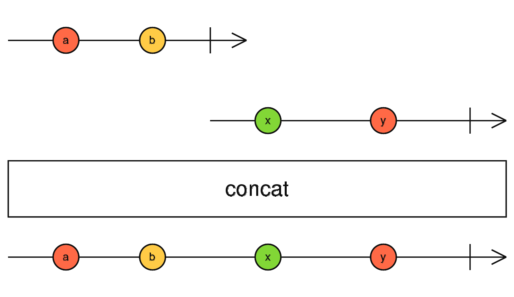

### concat <icon badge type='function'/> 
> 创建一个输出Observable, 该Observable依次输出所有Observable给定的值, 然后移至下一个。
```ts
concat<O extends ObservableInput<any>, R>(...observables: (SchedulerLike | O)[]): Observable<ObservedValueOf<O> | R>
```

#### 参数

| 键名 | 描述 |
| --- | --- |
| observables | Type: `(schedulerLike | 0)[]`

#### 返回
`Observable<ObservedValueOf<O> | R>`: 每个传递的Observable的所有值按顺序合并到一个Observable中。

### 描述
> 根据派发值的顺序依次将Observable串联起来。

`concat`通过一次订阅一个并将它们的结果合并到输出Observable中, 从而将多个Observable结合在一起。你可以将这些Observables以数组形式(?-实测好像不行)或者直接当做参数。 传递一个空数组将直接导致Observable完成。

`concat`将订阅第一个输入Observable并派发它的所有值, 并且不会改变或影响这些值。 当Observable完成时, 它将订阅下一个Observable并且派发它的所有值。 这会重复执行, 知道操作符执行完了它的所有Observable。 当最后一个输入的Observable完成时, `concat`也将同时完成。 在任何时刻, 只有一个Observable会给操作符传递值。 如果你希望同时从传的Observable派发值, 可以看看[<font color=#B7178C>merge</font>](/doc/reference/index/merge.html), 特别是它的可选项`concurrent`参数。 事实上, `concat`是`merge`操作符的将`concurrent`参数设为`1`的一种配置。

注意, 如果一些输入的Observable永远不会完成, `concat`也将永远不会完成, 并且那个没有完成的Observable的下一个Observable也不会被订阅。 另一方面, 如果一些Observable在它订阅后立马完成(即直接执行`complete`), 那么`concat`会忽略它, 并且会移步到下一个Observable。

如果链中有任何Observable发生错误, 并且没有将控制权传递给下一个Observable, 那么`concat`也会立即发生错误。一个派发错误的Observable之后的Observable将永远不会被订阅。

如果你多次传递给`concat`同样的Observable, 它的值流将会在每次订阅时'重放', 这意味着你可以重复传递Observable任意次数。 如果你需要单调的传递1000次同样的Observable给`concat`, 你可以使用[<font color=#B7178C>repeat</font>](/doc/reference/index/repeat.html)。

### 举例
连接一个从0-3的计时器和一个从1-10的同步队列
```ts
import { concat, interval, range } from 'rxjs';
import { take } from 'rxjs/operators';

const timer = interval(1000).pipe(take(4));
const sequence = range(1, 10);
const result = concat(timer, sequence);
result.subscribe(x => console.log(x));

// results in:
// 0 -1000ms-> 1 -1000ms-> 2 -1000ms-> 3 -immediate-> 1 ... 10
```
连接3个Observable
```ts
import { concat, interval } from 'rxjs';
import { take } from 'rxjs/operators';

const timer1 = interval(1000).pipe(take(10));
const timer2 = interval(2000).pipe(take(6));
const timer3 = interval(500).pipe(take(10));

const result = concat(timer1, timer2, timer3);
result.subscribe(x => console.log(x));

// results in the following:
// (Prints to console sequentially)
// -1000ms-> 0 -1000ms-> 1 -1000ms-> ... 9
// -2000ms-> 0 -2000ms-> 1 -2000ms-> ... 5
// -500ms-> 0 -500ms-> 1 -500ms-> ... 9
```
连接同样的Observable
```ts
import { concat, interval } from 'rxjs';
import { take } from 'rxjs/operators';

const timer = interval(1000).pipe(take(2));

concat(timer, timer) // concatenating the same Observable!
.subscribe(
  value => console.log(value),
  err => {},
  () => console.log('...and it is done!')
);

// Logs:
// 0 after 1s
// 1 after 2s
// 0 after 3s
// 1 after 4s
// "...and it is done!" also after 4s
```
### 重载
* 详见[<font color=#B7178C>官方原文档</font>](https://rxjs-dev.firebaseapp.com/api/index/function/concat#concatenate-the-same-observable-to-repeat-it)