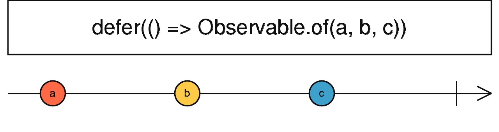

### defer <icon badge type='function'/> 
> 创建一个Observable, 在订阅时, 该Observable调用Observable工厂函数以使每个新的Observer都成为Observable。
```ts
defer<R extends ObservableInput<any> | void>(observableFactory: () => R): Observable<ObservedValueOf<R>>
```
#### 返回
`Observable<ObservedValueOf<R>>`: 一个Observable, 其Observers的订阅触发给定的Observable工厂函数的调用。

### 描述
  > 只有在订阅时, 才惰性创建Observable。
  

  `defer`可以让你在Observer订阅时创建Observable, 并且对每个Observer都创建一个新的Observable。 它会等到Observer订阅后, 然后生成一个Observable,一般通过Observable工厂函数创建。 它对每个订阅者都会重新开始, 即使这些订阅者订阅的是同一个Observable, 事实上每个订阅者都有对应独立的Observable。

### 举例
随机订阅一个点击Observable或者定时器Observable。
```ts
import { defer, fromEvent, interval } from 'rxjs';

const clicksOrInterval = defer(function () {
  return Math.random() > 0.5
    ? fromEvent(document, 'click')
    : interval(1000);
});
clicksOrInterval.subscribe(x => console.log(x));

// 将会出现以下结果:
// 如果Math.random() > 0.5, 则会监听document的点击事件, 当document被点击时, 会log一个鼠标点击事件, 如果Math.random() <= 0.5, 则会每秒打印数字。
```
参见: 
  * [<font color=#B7178C>Observable</font>](/doc/reference/index/observable.html)