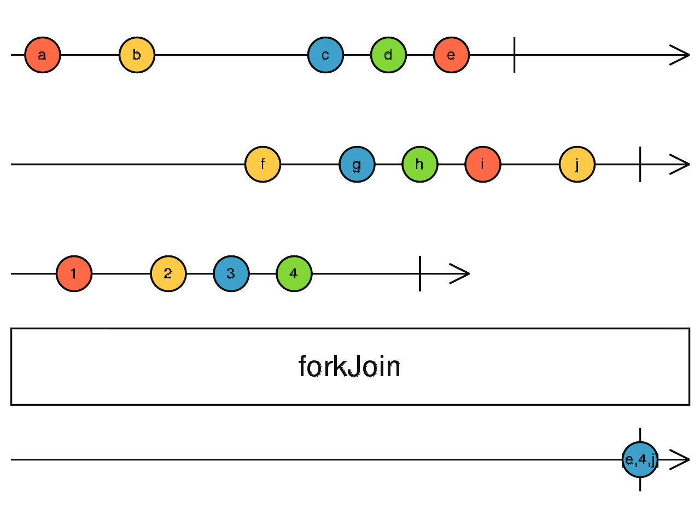

### concat <icon badge type='function'/> 
> 接受一个[<font color=#B7178C>Observable</font>](/doc/reference/index/observableInput.html)数组或者一个[<font color=#B7178C>Observable</font>](/doc/reference/index/observableInput.html)的字典对象, 返回一个跟入参数组同样顺序的值数组, 或者跟入参字典同样结构的值字典。
```ts
forkJoin(...sources: any[]): Observable<any>
```
#### 参数
| 键名 | 描述 |
| --- | --- |
| sources | 以数组或参数形式直接传递给运算符的任意数量的Observable |

### 描述
> 等待Observables完成, 然后将它们派发的最后的值结合起来。


`forkJoin`是一个需要任意数量的Observables的操作符, 可以以数组或者字典形式将Observables传递给它。如果没有传递Observables, 则会导致流立即完成。
`forkJoin`将会等待所有传递给它的Observable完成后, 派发一个由对应Observable产生的值的数组或对象。
如果你传递`n`个observable的数组给该操作符, 结果数组也会有`n`个值, 第一个值是第一个Observable派发的最后一个值, 第二个值是第二个Observable派发的最后一个值, 以此类推。
如果你传递一个observable字段给该操作符, 结果对象会有与字典一样的键名, 每个键对应的值是每个observable派发的最后一个值。
这意味着`forkJoin`只会派发一次并且在派发完后直接结束。 如果你需要派发的值不仅仅是每个Observable最后派发的值的结合, 而是有其他值的结合, 你可以试试[<font color=#B7178C>combineLatest</font>](/doc/reference/index/combineLatest.html)或[<font color=#B7178C>zip</font>](/doc/reference/index/zip.html)

为了保证结果数组的长度与输入的Observable的数量一致, 只要有任何Observable没有派发值便完成了, `forkJoin`就会同时结束, 并且它不会派发任何东西, 即使它已经从其他某些Observable中获得一些值。 相反的, 如果有一个Observable永远不会完成, `forkJoin`也永远不会完成, 除非在某个时间点, 有个Observable不派发值便结束了。 总之, `forkJoin`想要派发值, 那么所有Observable都必须至少派发一个值才能完成。
`forkJoin`接受一个可选的project函数, 它会配合那个将要被派发的数组中的值被调用。无论该函数返回什么, 都会取代输出的Observable。这意味着, 默认的project函数可以被看做是具有所有参数并将其放入数组的函数。 请注意, 只有在输出Observable将要派发结果时, project函数才会被调用。

### 举例
用observable字典作为输入项
```ts
import { forkJoin, of, timer } from 'rxjs';

const observable = forkJoin({
  foo: of(1, 2, 3, 4),
  bar: Promise.resolve(8),
  baz: timer(4000),
});
observable.subscribe({
 next: value => console.log(value),
 complete: () => console.log('This is how it ends!'),
});

// Logs:
// { foo: 4, bar: 8, baz: 0 } after 4 seconds
// "This is how it ends!" immediately after
```
用observable数组作为输入项
```ts
import { forkJoin, of, timer } from 'rxjs';

const observable = forkJoin([
  of(1, 2, 3, 4),
  Promise.resolve(8),
  timer(4000),
]);
observable.subscribe({
 next: value => console.log(value),
 complete: () => console.log('This is how it ends!'),
});

// Logs:
// [4, 8, 0] after 4 seconds
// "This is how it ends!" immediately after
```
默认project函数demo展示:
```ts
import { forkJoin, of, timer } from 'rxjs';

const observable = forkJoin([
  of(1, 2, 3, 4),
  Promise.resolve(8),
  timer(4000),
], (x, y, z) => [x, y, z]); // 可以将默认的project function 看成是 (x, y, z) => [x, y, z] 
observable.subscribe({
 next: value => console.log(value),
 complete: () => console.log('This is how it ends!'),
});
// Logs:
// [4, 8, 0] after 4 seconds
// "This is how it ends!" immediately after
```
### 重载
* 详见[<font color=#B7178C>官方原文档</font>](https://https://rxjs-dev.firebaseapp.com/api/index/function/forkJoin)