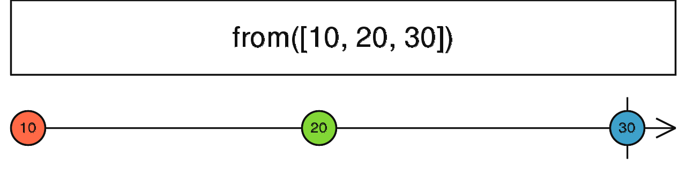

### concat <icon badge type='function'/> 
> 根据一个数组, 类数组对象, Promise, 可迭代对象, 类Observbale对象创建一个Observable。
```ts
  from<T>(input: any, scheduler?: SchedulerLike): Observable<T>
```
#### 参数
| 键名 | 描述 | 
| input | Type: `any` |
| scheduler | 可选项。 默认值是`undefined`。 Type: `SchedulerLike` |
#### 返回
`Observable<T>`

### 描述
> 几乎可以把任何东西转化为Observable

`from`将不同的其他对象和数据类型转换成Observables。 它也可以将Promise, 类数组 或者可迭代对象转换成Observable, 并且可以将promise, 类数组, 可迭代对象中的值派发出去。 在上下文中, 一个字符串会被当做一些字符的数组。 类Observable对象(包含以ES2015 Symbol for Observable命名的函数)同样也能通过该操作符被转换。

### 举例
将一个数组转换成Observable
```ts
import { from } from 'rxjs';

const array = [10, 20, 30];
const result = from(array);

result.subscribe(x => console.log(x));

// Logs:
// 10
// 20
// 30
```
将一个无限迭代器(generator)转换成Observable
```ts
import { from } from 'rxjs';
import { take } from 'rxjs/operators';

function* generateDoubles(seed) {
   let i = seed;
   while (true) {
     yield i;
     i = 2 * i; // double it
   }
}

const iterator = generateDoubles(3);
const result = from(iterator).pipe(take(10));

result.subscribe(x => console.log(x));

// Logs:
// 3
// 6
// 12
// 24
// 48
// 96
// 192
// 384
// 768
// 1536
```
配合异步调度器使用
```ts
import { from, asyncScheduler } from 'rxjs';

console.log('start');

const array = [10, 20, 30];
const result = from(array, asyncScheduler);

result.subscribe(x => console.log(x));

console.log('end');

// Logs:
// start
// end
// 10
// 20
// 30
```
### 参见
* [<font color=#B7178C>fromEvent</font>](/doc/reference/index/fromEvent.html)
* [<font color=#B7178C>fromEventPattern</font>](/doc/reference/index/fromEventPattern.html)
