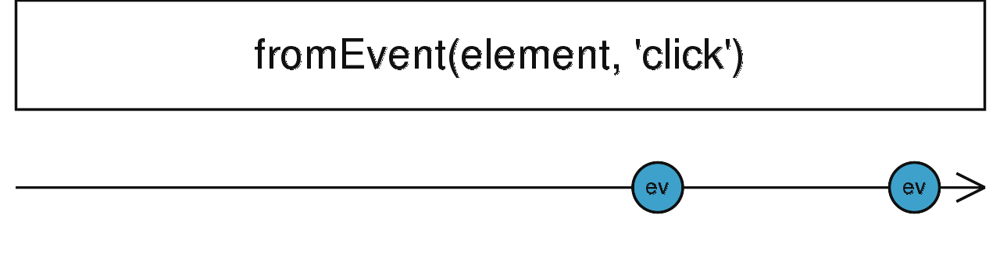

### concat <icon badge type='function'/> 
> 创建一个Observable, 它只派发来自事件对象的特殊类型事件。
```ts
fromEvent<T>(target: FromEventTarget<T>, eventName: string, options?: EventListenerOptions | ((...args: any[]) => T), resultSelector?: (...args: any[]) => T): Observable<T>
```
#### 参数
| 键名 | 描述 |
| --- | --- |
| target | 接受DOM EventTarget, Node.js EventEmitter, JQuery-like event target, NodeList 或者 HTML Collection 这类事件 | 
| eventName | 目标派发的出的事件名(你要监听的) | 
| options | 可选项。 默认值是`undefined`。传递给addEventListener的选项。
| resultSelector | 可选项。 默认值是`undefined`。 Type: `(...args: any[]) => T`。

#### 返回
`Observable<T>`

### 描述
> 根据DOM events, Node.js EventEmitter event或者其他的来创建一个Observable。

`fromEvent` 接受事件目标作为第一个参数, 该目标是具有注册事件处理程序函数的方法对象。第二个参数是我们需要监听的事件类型的字符串(如'click')。 `fromEvent`支持事件目标的选择类型,这点下面会讲到。 如果你的事件目标与列出的目标不匹配, 则应该使用[<font color=#B7178C>fromEventPattern</font>](/doc/reference/index/fromEventPattern.html), 该目标可以在任意API上使用。对于fromEvent支持的API，它们用于添加和删除事件处理程序函数的方法具有不同的名称，但是它们都接受描述事件类型和函数本身的字符串，只要发生所述事件，就会调用该字符串。

每当结果Observable被订阅, 在事件目标上就会注册指定类型的事件处理函数。 当事件触发时, 作为第一个参数传递给已注册函数的值将被输出Observable派发。当Observable取消订阅时, 监听函数将会从事件对象上取消注册。

注意, 如果事件对象调用注册的监听函数有超过一个的参数, 那么第二个以及之后的参数将不会出现在结果流里。 为了访问到它们, 你可以将可选的包装函数(project function)传递给`fromEvent`, 它将会被所有传递给事件处理函数的参数调用。 输出的Observable将在之后派发包装函数返回的值, 以此来取代通常返回的值。

请记住, 下面列出的事件目标是通过[<font color=#B7178C>鸭子类型</font>](https://www.cnblogs.com/moqiutao/p/13899358.html)检测的。 这意味着, 只要该事件目标暴露了所描述的方法(它们行为如上所述), 那么无论你拥有哪种类型的对象或是在什么环境中运行, 都可以在该对象上安全的使用`fromEvent`。 举个例子, 如果Node.js暴露的事件目标与DOM EventTarget有同样的方法名, 那么依旧可以使用`fromEvent`。

`fromEvent`支持以下事件目标的类型:

* DOM EventTarget
  该对象有`addEventListener`和`removeEventListener`这两个方法。
  在浏览器中，`addEventListener`接受-除了事件类型字符串和事件处理程序函数参数外-可选的第三个参数，它是一个对象或布尔值，均用于附加配置，如何以及何时调用传递的函数。 当fromEvent与该类型的事件目标一起使用时，您也可以将此值作为第三个参数来提供。
* Node.js EventEmitter
  一个有`addListener`和`removeListener`方法的对象。
* JQuery-style event target
  一个有`on`和`off`方法的对象。
* DOM NodeList
  DOM节点列表, 一般通过`document.querySelector`或`Node.childrenNodes`返回。
  即使这类本身不是事件对象, `fromEvent`将会迭代它包含的所有节点并且在每个节点上安装一个事件处理方法。 当返回的Observable被取消订阅时, 这些方法会从节点上被移除。
* DOM HTMLCollection
  跟NodeList的例子一样,它是一个DOM节点的集合, 这里也会在每个元素上安装和移出事件处理函数。

### 举例
派发在document上的点击事件
```ts
import { fromEvent } from 'rxjs';

const clicks = fromEvent(document, 'click');
clicks.subscribe(x => console.log(x));

// Results in:
// MouseEvent object logged to console every time a click
// occurs on the document.
```
使用`addEventListener`配合捕获选项(即第三个参数)
```ts
import { fromEvent } from 'rxjs';

const clicksInDocument = fromEvent(document, 'click', { capture: true }); //可选项配置参数
const someDivInDocument = document.querySelector("#div")                                                    
const clicksInDiv = fromEvent(someDivInDocument, 'click');

clicksInDocument.subscribe(() => console.log('document'));
clicksInDiv.subscribe(() => console.log('div'));

// 默认是向上冒泡事件, 即当我们点在在document上的div时,
// 会先打印'div', 然后打印'document'.
// 因为我们设置了可选项'capture', 则变成了自上而下的捕获事件,
// 所以会先打印'document', 然后打印'div'
```
### 重载
* [<font color=#B7178C>官方原文档</font>](https://rxjs-dev.firebaseapp.com/api/index/function/fromEvent)