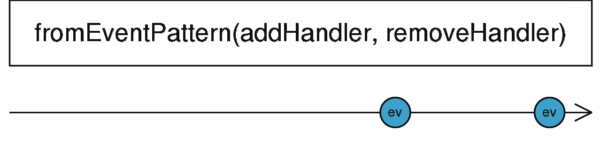

### fromEventPattern <icon badge type='function'/> 
> 根据任意API创建一个Observable来注册事件手柄。
```ts
fromEventPattern<T>(addHandler: (handler: NodeEventHandler) => any, removeHandler?: (handler: NodeEventHandler, signal?: any) => void, resultSelector?: (...args: any[]) => T): Observable<T | T[]>
```

#### 参数
| 键名 | 描述 | 
| addHandler | 以手柄函数为参数并将其以某种方式附加到实际事件源的函数 |
| removeHandler | 可选项。默认值是`undefined`。 以手柄函数作为参数并将其从事件源上溢出的方法。 如果`addHandler`返回某种类型的token, `removeHandler`函数将会将其当成第二个参数。 |
| resultSelector | 可选项。 默认值是`undefined`。 Type: `(...args: any[]) => T ` |

#### 返回
`Observable<T | T[]>`: 这个Observable当事件发生时, 派发第一个参数给已注册的事件函数, 或者, 它派发任何包装函数(project function)返回的东西。

### 描述
> 当添加事件手柄的方法并不是[<font color=#B7178C>fromEvent</font>](/doc/reference/index/fromEvent.html)所能应对时使用该操作符。

`fromEventPattern`允许你去将任意支持为事件注册手柄方法的API转换成一个Observable。 这有点像[<font color=#B7178C>fromEvent</font>](/doc/reference/index/fromEvent.html), 但是更灵活。 事实上, 所有使用[<font color=#B7178C>fromEvent</font>](/doc/reference/index/fromEvent.html)的例子都可以用`fromEventPattern`简单的实现(虽然有点复杂)

这个操作符接受`addHandler`函数作为第一个参数, 该函数会被传递手柄函数参数。 这个手柄函数实际上是一个事件处理函数并且你可以将预期的API传递给它。`addHandler`将会在该操作符返回的Observable被订阅时调用, 所以当`fromEventPattern`调用时不一定会在API中注册手柄函数。

注册完后, 每当我们监听的事件发生了, `fromEventPattern`返回的Observable将会派发值, 该值是事件处理函数的第一个参数。 注意, 即使事件手柄函数配合超过一个的参数的被调用, 第二个及之后的参数都不会出现在Observable中。

如果你使用的API允许去卸载事件手柄函数, 你可以将`removeHandler`作为第二个参数传递给`fromEventListener`。它和之前的一样, 将被传递相同的手柄函数参数, 你可以用该函数从API中取消注册。`removeHandler`在结果Observable被消费者取消订阅时会被调用。

在一些APIS中取消订阅的处理方法是不同的。 注册事件手柄的方法会返回某些token, 这些token在之后会用去验证哪些方法会被取消注册或者其本身带有取消注册事件手柄的方法。如果你的API是这种情况, 请确保你的token是由`addHandler`方法返回的。 之后它会以第二个参数传递给`removeHandler`, 你可以在这里使用它。

如果你需要去访问所有事件手柄函数的参数(不仅仅是第一个), 或者需要将他们以某种形式转换, 你可以调用第三个可选项参数`formEventPattern`这个包装函数, 该函数被调用时会接受所有传递给事件手柄的参数。 包装函数(`fromEventPattern`)无论返回什么都将出现在结果流里以取代通常事件手柄的第一个参数。 这意味着默认的包装函数可以被当成是只具有第一个参数并忽略其他参数的方法。

### 举例
派发点击事件
```ts
import { fromEventPattern } from 'rxjs';

function addClickHandler(handler) {
  document.addEventListener('click', handler);
}

function removeClickHandler(handler) {
  document.removeEventListener('click', handler);
}

const clicks = fromEventPattern(
  addClickHandler,
  removeClickHandler
);

const observer = clicks.subscribe(x => console.log(x));


setTimeout(() => {
  observer.unsubscribe()
  console.log('取消订阅')
}, 2000)
// 点击任意地方都会log
// 2S后会取消订阅, 之后便无法log
```

使用一些返回撤销token的API
```ts
import { fromEventPattern } from 'rxjs';

const token = someAPI.registerEventHandler(function() {});
someAPI.unregisterEventHandler(token); // 这些API取消订阅的方法只接受特殊的token, 而不接受其手柄本身。

const someAPIObservable = fromEventPattern(
  function(handler) { return someAPI.registerEventHandler(handler); }, // 在这返回token
  function(handler, token) { someAPI.unregisterEventHandler(token); }  // 在这使用token
);
```
配合包装函数使用
```ts
import { fromEventPattern } from 'rxjs';

someAPI.registerEventHandler((eventType, eventMessage) => {
  console.log(eventType, eventMessage); // Logs "EVENT_TYPE" "EVENT_MESSAGE" to console.
});

const someAPIObservable = fromEventPattern(
  handler => someAPI.registerEventHandler(handler),
  handler => someAPI.unregisterEventHandler(handler)
  (eventType, eventMessage) => eventType + " --- " + eventMessage // without that function only "EVENT_TYPE"
);                                                                // would be emitted by the Observable

someAPIObservable.subscribe(value => console.log(value));

// Logs:
// "EVENT_TYPE --- EVENT_MESSAGE"
```

### 参见
* [<font color=#B7178C>fromEvent</font>](/doc/reference/index/fromEvent.html)
* [<font color=#B7178C>bindCallback</font>](/doc/reference/index/bindCallback.html)
* [<font color=#B7178C>bindNodeCallback</font>](/doc/reference/index/bindNodeCallback.html)