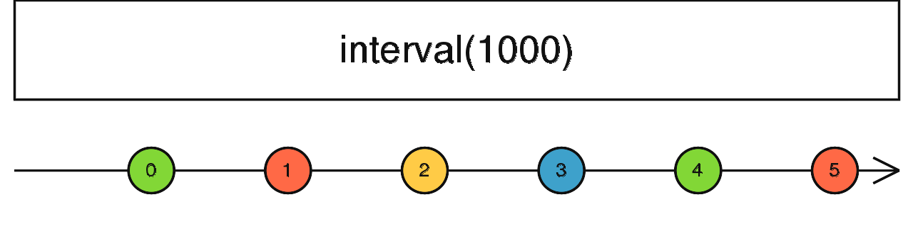

### interval <icon badge type='function'/> 
> 创建一个Observable, 该Observable会在指定的类调度器上每隔一段时间派发序号。
```ts
interval(period: number = 0, scheduler: SchedulerLike = async): Observable<number>
```
#### 参数
| 键名 | 描述 |
| --- | --- |
| period | 可选项。 默认值是`0`。 间隔大小(默认以毫秒为单位)或者时间单元由调度器的时钟决定。 |
| scheduler | 可选项。 默认是`async`。[<font color=#B7178C>SchedulerLike</font>](/doc/reference/index/SchedulerLike.html)用来调度派发值, 并且提供一个'时间'的概念。 |
#### 返回
`Observable<number>`:一个Observable, 其每个一段时间间隔会派发一个序号。
### 描述
> 定期派发递增数字。

`interval`返回个Observable, 它会派发无限个的递增整数序列, 并在这些派发之间选择一个固定的时间间隔。第一个派发不是立即发出的, 而是等待第一个间隔后再发。这个操作符默认使用[<font color=#B7178C>SchedulerLike</font>](/doc/reference/index/SchedulerLike.html)去提供一个'时间'概念, 但是你也可以传递任何[<font color=#B7178C>SchedulerLike</font>](/doc/reference/index/SchedulerLike.html)给它。

### 举例
派发升序数字, 每个一秒钟一直到发到数字3。
```ts
import { interval } from 'rxjs';
import { take } from 'rxjs/operators';

const numbers = interval(1000);

const takeFourNumbers = numbers.pipe(take(4));

takeFourNumbers.subscribe(x => console.log('Next: ', x));

// Logs:
// Next: 0
// Next: 1
// Next: 2
// Next: 3
```
### 参见
* [<font color=#B7178C>timer</font>](/doc/reference/index/timer.html)
* [<font color=#B7178C>delay</font>](/doc/reference/index/delay.html)