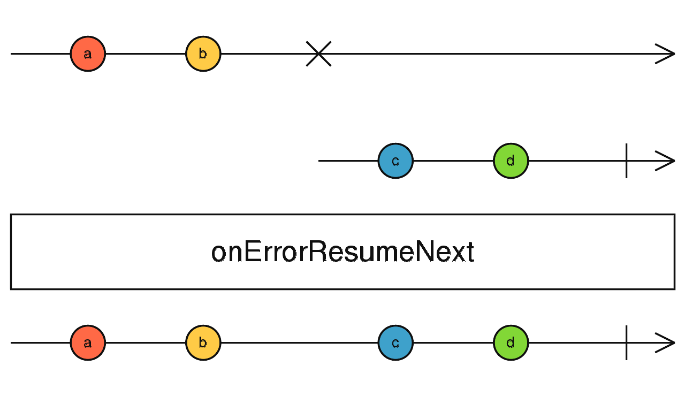

### onErrorResumeNext <icon badge type='function'/>
> 当任何提供的Observable发出完成或者异常的通知时, 它将立刻订阅下一个已传入的Observable
```ts
onErrorResumeNext<T, R>(...sources: any[]): Observable<R>
```
#### 参数
| 键名 | 描述 |
| --- | --- |
| sources | 无论是直接传入或者以数组形式传入的Observable(或者是任何可观察的东西) |
#### 返回
`Observable<R>` 该Observable会串联了所有源Observable(一个接一个), 它会忽略所有异常, 因为一旦碰到异常都会导致它订阅下一个传入的Observable。
### 描述
> 执行完所有Observables, 即使碰到异常。

`onErrorResumeNext`将会按顺序订阅每个提供的可观察对象源。如果被订阅的源发出错误或者完成的通知, 它将会订阅下一个并忽略异常。

如果不给`onErrorResumeNext`提供参数, 或者提供了一个空的数组, 它将会返回[<font color=#B7178C>EMPTY</font>](/doc/reference/index/empty.html)

`onErrorResumeNext`基本上可被认为是[<font color=#B7178C>concat</font>](/doc/reference/index/concat.html), 只是它碰到源发出异常时会继续工作。

注意, 没有任何方法可以处理在`onErrorResumeNext`结果中被源抛出的异常。如果你想去处理由给定源抛出的异常, 你可以在将它们传递给`onErrorResumeNext`之前对这些异常使用[<font color=#B7178C>catchError</font>](/doc/reference/index/catchError.html)操作符。
### 举例
在`map`操作符执行失败后订阅下一个Observable
```ts
import { onErrorResumeNext, of } from 'rxjs';
import { map } from 'rxjs/operators';

onErrorResumeNext(
 of(1, 2, 3, 0).pipe(
   map(x => {
     if (x === 0) throw Error();
     return 10 / x;
   })
 ),
 of(1, 2, 3),
)
.subscribe(
  val => console.log(val),
  err => console.log(err),          // Will never be called.
  () => console.log('done'),
);
// Logs:
// 10
// 5
// 3.3333333333333335
// 1
// 2
// 3
// "done"
```
### 重载
* 详见[<font color=#B7178C>官方原文档</font>](https://rxjs-dev.firebaseapp.com/api/index/function/onErrorResumeNext)
