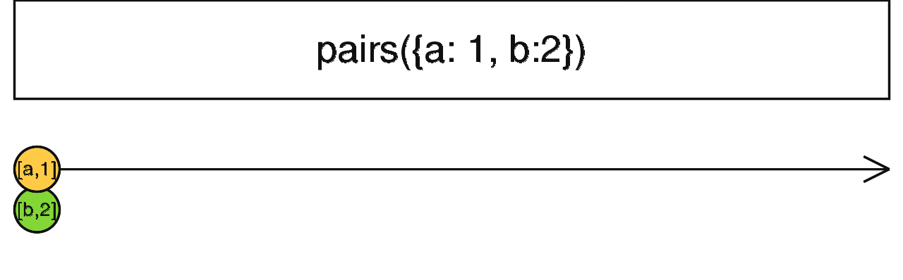

### pairs <icon badge type='function'/> 
> 将一个object转换成其值为一对或多对`[key, value]`的Observable。
```ts
pairs<T>(obj: Object, scheduler?: SchedulerLike): Observable<[string, T]>
```
#### 参数
| obj | 要检查的对象, 并且会变成Observable序列 |
| scheduler | 可选项。默认值是`undefined`。去调度结果Observable何时派发值 |
#### 返回
`Observable<[string, T]>`:根据object生成的一串可观察的`[key, string]`。
### 描述
> 将整个对象转换成一个流。

`pairs`需要一个任意的对象作为参数并且返回一个派发数组的Observable。每个派发的数组都有2个元素 - 第一个是对象键名(key), 第二个是键名对应的值(value)。Keys是通过`Object.keys`方法从对象中提取出来, 这意味着他们只是存在于对象上可枚举的键 - 不包括继承于原型链上的键。

这些数组默认会被同步派发。你可以传递一个[<font color=#B7178C>SchedulerLike</font>](/doc/reference/index/SchedulerLike.html)作为`pairs`的第二参数去改变。
### 举例
流式化一个对象的键/值对。用这个对象表示字典时特别有用。[<font color=#B7178C>参考</font>](https://zhuanlan.zhihu.com/p/43605482)
```ts
import { pairs } from 'rxjs'
const foo = { a: 1, b: 2};

pairs(foo)
  .subscribe();
// 结果
// [a,1] [b,2] |
```