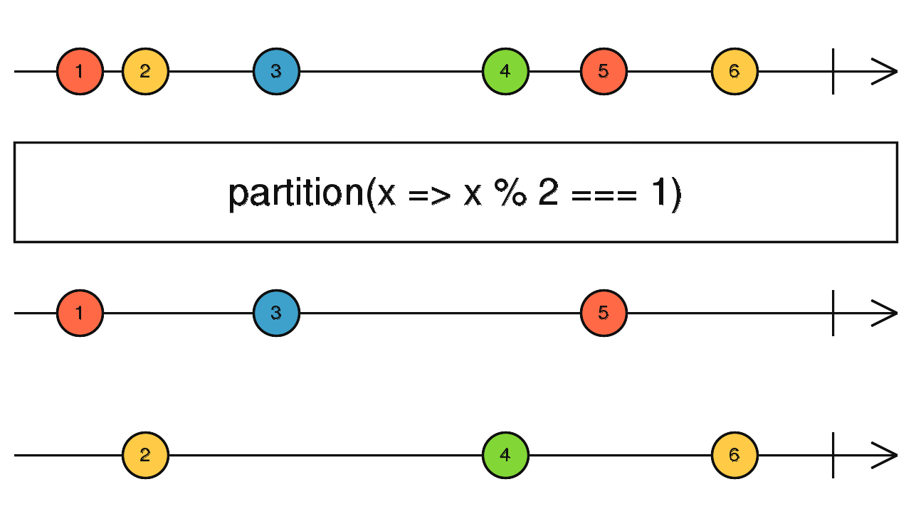

### partition <icon badge type='function'/> 
> 将源Observable分成两部分, 一部分满足`predicate`的要求, 一部分不满足`predicate`的要求。
```ts
partition<T>(source: any, predicate: (value: T, index: number) => boolean, thisArg?: any): [Observable<T>, Observable<T>]
```
#### 参数
| 键名 | 描述 |
| --- | --- |
| source | Type:`any` |
| predicate | 这是一个函数, 它会评估每个被源Observable派发的值。如果返回`true`,这个值会被所返回数组中的第一个Observable派发, 如果为`false`则该值会被返回数组中第二个Observable派发。其第二个参数`index`代表着自订阅之后源派发数量的序号, 该序号从0开始。
#### 返回
`[Observable<T>, Observable<T>]`:由2个Observable组成的数组, 前者的值符合`predicate`的条件, 后者的值不符合`predicate`的条件。
### 描述
> 这类似于[<font color=#B7178C>filter</font>](/doc/reference/index/filter.html), 但不同的是其返回2个Observable: 一个同`filter`的输出一致, 另一个的值是不符合条件的。

`partition`输出一个由2个Observable构成的数组, 之所以有2个Observable是因为`predicate`函数对源Observable的值进行的评估分割。第一个Observable派发的是作为`predicate`的入参并最后返回`true`的值。第二个Observable派发的是作为`predicate`的入参并最后返回`false`的值。第一个的行为类似于`filter`, 第二个则是跟`filter`相反。
### 举例
将一个数字集合分割成奇偶两个观察者
```ts
import { of, partition } from 'rxjs';

const observableValues = of(1, 2, 3, 4, 5, 6);
const [evens$, odds$] = partition(observableValues, (value, index) => value % 2 === 0);

odds$.subscribe(x => console.log('odds', x));
evens$.subscribe(x => console.log('evens', x));

// Logs:
// odds 1
// odds 3
// odds 5
// evens 2
// evens 4
// evens 6
```
### 参见
* [<font color=#B7178C>filter</font>](/doc/reference/index/filter.html)