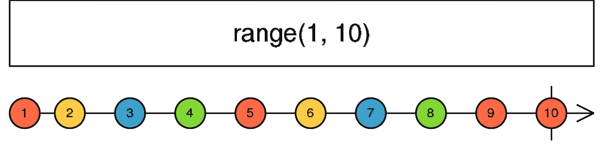

### range <icon badge type='function'/>
> 创建一个Observable, 它发出指定范围内的一串数字。
```ts
range(start: number = 0, count?: number, scheduler?: SchedulerLike): Observable<number>
```
#### 参数
| 键名 | 描述 |
| --- | --- |
| start | 可选项。默认值是`0`。区间的整数起始点 |
| count | 可选项。默认值是`undefined`。区间的长度(整数) |
| scheduler | 可选项。默认值是`undefined`。一个[<font color=#B7178C>SchedulerLike</font>](/doc/reference/index/SchedulerLike.html)用来调度通知的派发。 |
#### 返回
`Observable<number>`:该Observable发出有限区间内的所有整数。
### 描述
> 派发某个区间内的整数序列

`range`操作符发出一个范围内的整数序列, 其顺序是你依据你选择的`start`和`count`。默认情况下, 不使用[<font color=#B7178C>SchedulerLike</font>](/doc/reference/index/SchedulerLike.html)且同步发出通知, 但是你可以使用[<font color=#B7178C>SchedulerLike</font>](/doc/reference/index/SchedulerLike.html)去规定派发顺序。
### 举例
发出1-10的的数字
```ts
import { range } from 'rxjs';

const numbers = range(1, 10);
numbers.subscribe(x => console.log(x));
```
### 参见
* [<font color=#B7178C>timer</font>](/doc/reference/index/timer.html)
* [<font color=#B7178C>interval</font>](/doc/reference/index/interval.html)