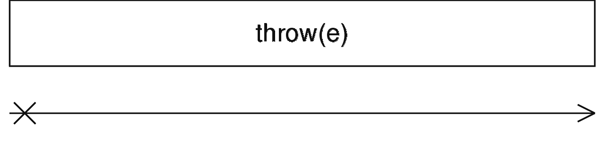

### throwError <icon badge type='function'/>
> 创建一个Observable, 该Observable不派发值给观察者而是立即派发一个异常通知。
```ts
throwError(error: any, scheduler?: SchedulerLike): Observable<never>
```
#### 参数
| 键名 | 描述 |
| --- | --- |
| error | 传递给异常通知的特殊异常 |
| scheduler | 可选项。默认值是`undefined`。一个用来调度异常通知派发的[<font color=#B7178C>schedulerLike</font>](/doc/reference/index/schedulerLike.html) |
#### 返回
`Observable<never>`:一个异常Observable:根据给定的异常参数派发异常通知。
### 描述
> 仅发出'异常', 没有其他内容。

该静态操作符可以用来创建一个仅仅派发异常通知的Observable。它可以用于与其他Observable进行合成, 例如在[<font color=#B7178C>mergeMap</font>](/doc/reference/index/mergeMap.html)
### 举例
发出一个数字7, 然后发出异常
```ts
import { throwError, concat, of } from 'rxjs';

const result = concat(of(7), throwError(new Error('oops!')));
result.subscribe(x => console.log(x), e => console.error(e));

// Logs:
// 7
// Error: oops!
```
将数字映射和展平到序列'a', 'b', 'c', 在数字2时抛出异常。
```ts
import { throwError, interval, of } from 'rxjs';
import { mergeMap } from 'rxjs/operators';

interval(1000).pipe(
  mergeMap(x => x === 2
    ? throwError('Twos are bad')
    : of('a', 'b', 'c')
  ),
).subscribe(x => console.log(x), e => console.error(e));

// Logs:
// a
// b
// c
// a
// b
// c
// Twos are bad
```
### 参见
* [<font color=#B7178C>Observable</font>](/doc/reference/index/Observable.html)
* [<font color=#B7178C>empty</font>](/doc/reference/index/empty.html)
* [<font color=#B7178C>never</font>](/doc/reference/index/never.html)
* [<font color=#B7178C>of</font>](/doc/reference/index/of.html)