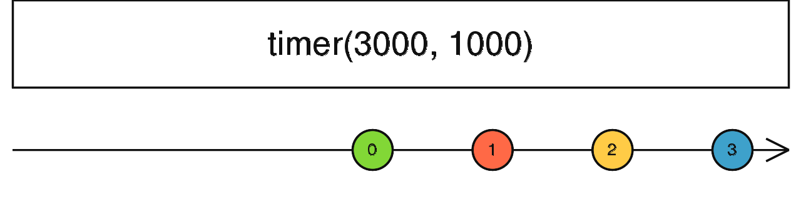

### timer <icon badge type='function'/>
>  创建一个Observable, 该Observable在指定初始延时时间(dueTime)后开始发送并且在每个时间周期(periodOrScheduler)后发出自增的数字。
```ts
timer(dueTime: number | Date = 0, periodOrScheduler?: number | SchedulerLike, scheduler?: SchedulerLike): Observable<number>
```
#### 参数
| 键名 | 描述 |
| --- | --- |
| dueTime | 可选项。默认值是`0`。初始延时时间, 可以是一个Date对象也可以是以毫秒为单位的整数 |
| periodOrScheduler | 可选项。默认值是`undefined`。每次发送自增数字之间的间隔 |
| scheduler | 可选项。默认值是`undefined`。[<font color=#B7178C>schedulerLike</font>](/doc/reference/index/schedulerLike.html)用来调度派发值, 并提供一个"时间"的概念。|
#### 返回
`Observable<number>`: 一个Observable, 其在初始延时(dueTime)后发出`0`, 并在之后的每个时间周期(periodOrScheduler)后发出自增的数字。
### 描述
> 就像[<font color=#B7178C>interval</font>](/doc/reference/index/interval.html), 但是你可以指定什么时候开始派发。

`timer`返回一个Observable, 其可以派发无限升序序列的自增整数, 其派发的时间间隔是由你选择的`periodOrScheduler`决定的。第一次派发发生在指定的`dueTime`之后。初始延迟可能是一个`Date`。默认情况下, 操作符使用[<font color=#B7178C>async</font>](/doc/reference/index/async.html) [<font color=#B7178C>schedulerLike</font>](/doc/reference/index/schedulerLike.html)去提供一个时间概念, 但是你可以传递任意的`SchedulerLike`给它。如果`periodOrScheduler`没有指定, 输出的Observable将只会派发一个`0`。否则会发出一个无线序列。
### 举例
在三秒后开始发送一个派发间隔为1秒的自增数字序列
```ts
import { timer } from 'rxjs';

const numbers = timer(3000, 1000);
numbers.subscribe(x => console.log(x));
```
在5秒后仅发送一个数字
```ts
import { timer } from 'rxjs';

const numbers = timer(5000);
numbers.subscribe(x => console.log(x));
```
### 参见
* [<font color=#B7178C>interval</font>](/doc/reference/index/interval.html)
* [<font color=#B7178C>delay</font>](/doc/reference/index/delay.html)